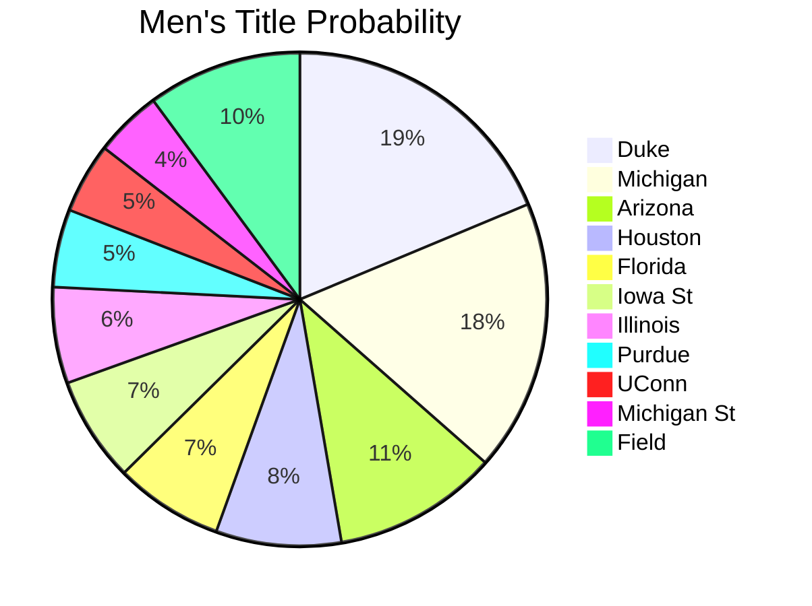
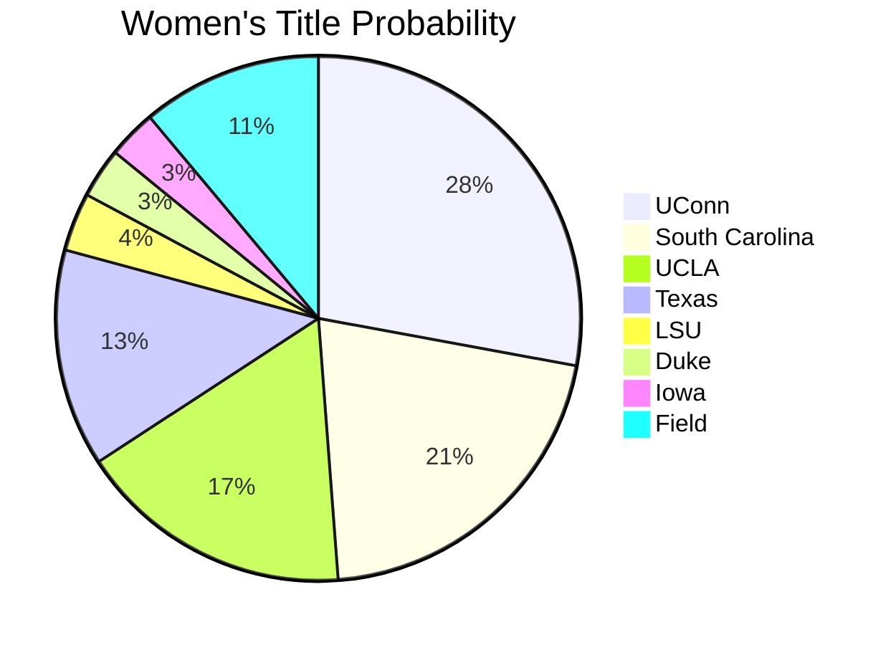
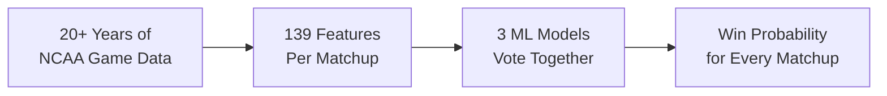
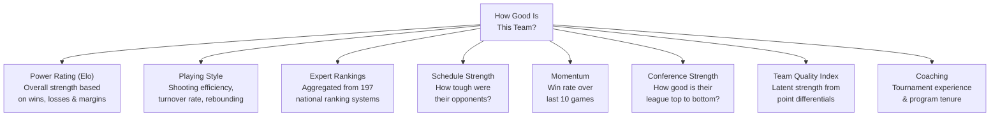

# Predicting March Madness 2026

Using machine learning to forecast every possible matchup in the 2026 NCAA Men's and Women's basketball tournaments — 132,133 predictions total.

Built for the [Kaggle March Machine Learning Mania 2026](https://www.kaggle.com/competitions/march-machine-learning-mania-2026) competition.

---

## Our Picks

### Men's — Who Cuts Down the Nets?




| #   | Team         | Power Rating | Title Odds | Make Finals |
| --- | ------------ | ------------ | ---------- | ----------- |
| 1   | **Duke**     | 2078         | **18.7%**  | 22.1%       |
| 2   | Michigan     | 2069         | 17.8%      | 21.3%       |
| 3   | Arizona      | 2032         | 10.8%      | 14.2%       |
| 4   | Houston      | 1967         | 8.2%       | 11.5%       |
| 5   | Florida      | 2035         | 7.1%       | 9.8%        |
| 6   | Iowa St      | 1861         | 6.9%       | 9.4%        |
| 7   | Illinois     | 1909         | 6.3%       | 8.7%        |
| 8   | Purdue       | 1884         | 5.1%       | 7.6%        |
| 9   | UConn        | 1971         | 4.6%       | 7.1%        |
| 10  | Michigan St  | 1935         | 4.4%       | 6.8%        |


### Women's — Who Takes the Crown?




| #   | Team               | Power Rating | Title Odds | Make Finals |
| --- | ------------------ | ------------ | ---------- | ----------- |
| 1   | **UConn**          | 2259         | **27.9%**  | 32.4%       |
| 2   | South Carolina     | 2200         | 20.9%      | 23.5%       |
| 3   | UCLA               | 2212         | 17.0%      | 19.2%       |
| 4   | Texas              | 2131         | 13.4%      | 15.6%       |
| 5   | LSU                | 2074         | 3.6%       | 5.2%        |
| 6   | Duke               | 2000         | 3.1%       | 4.8%        |
| 7   | Iowa               | 2015         | 3.0%       | 4.5%        |


> Championship odds from 50,000 Monte Carlo tournament simulations using our model's head-to-head win probabilities.

---

## Marquee Matchups

Games the model thinks will be the most competitive if these teams meet:


| Matchup              | Predicted Winner | Win Probability |
| -------------------- | ---------------- | --------------- |
| Duke vs Michigan     | Duke             | 50.3%           |
| Florida vs UConn     | Florida          | 50.5%           |
| Kansas vs Purdue     | Kansas           | 50.6%           |
| Arizona vs Houston   | Arizona          | 51.0%           |
| Duke vs Illinois     | Duke             | 51.0%           |
| Arizona vs Florida   | Arizona          | 51.4%           |


And the matchups the model is most confident about:


| Matchup              | Predicted Winner | Win Probability |
| -------------------- | ---------------- | --------------- |
| Michigan vs Kansas   | Michigan         | 90.5%           |
| Michigan vs BYU      | Michigan         | 89.8%           |
| Duke vs St Mary's    | Duke             | 88.9%           |
| Duke vs Alabama      | Duke             | 87.7%           |
| Michigan vs Gonzaga  | Michigan         | 86.4%           |


---

## First Round Predictions

The actual bracket matchups — who advances?

### Men's First Round

**EAST (Washington DC)**
| Matchup | Winner | Prob |
|---------|:------:|:----:|
| (1) Duke vs (16) Siena | Duke | 96.4% |
| (8) Ohio St vs (9) TCU | Ohio St | 58.0% |
| (5) St John's vs (12) Northern Iowa | St John's | 84.1% |
| (4) Kansas vs (13) Cal Baptist | Kansas | 85.8% |
| (6) Louisville vs (11) South Florida | Louisville | 80.5% |
| (3) Michigan St vs (14) N Dakota St | Michigan St | 90.4% |
| (7) UCLA vs (10) UCF | UCLA | 65.0% |
| (2) UConn vs (15) Furman | UConn | 94.0% |

**WEST (San Jose)**
| Matchup | Winner | Prob |
|---------|:------:|:----:|
| (1) Arizona vs (16) LIU | Arizona | 95.8% |
| (8) Villanova vs (9) Utah St | **Utah St** | **52.7%** |
| (5) Wisconsin vs (12) High Point | Wisconsin | 67.7% |
| (4) Arkansas vs (13) Hawaii | Arkansas | 86.2% |
| (6) BYU vs (11) Texas | BYU | 78.9% |
| (3) Gonzaga vs (14) Kennesaw | Gonzaga | 94.5% |
| (7) Miami FL vs (10) Missouri | Miami FL | 60.4% |
| (2) Purdue vs (15) Queens | Purdue | 93.8% |

**SOUTH (Houston)**
| Matchup | Winner | Prob |
|---------|:------:|:----:|
| (1) Florida vs (16) Prairie View | Florida | 96.4% |
| (8) Clemson vs (9) Iowa | **Iowa** | **56.6%** |
| (5) Vanderbilt vs (12) McNeese St | Vanderbilt | 78.1% |
| (4) Nebraska vs (13) Troy | Nebraska | 90.2% |
| (6) North Carolina vs (11) VCU | North Carolina | 76.4% |
| (3) Illinois vs (14) Penn | Illinois | 92.4% |
| (7) St Mary's vs (10) Texas A&M | St Mary's | 69.8% |
| (2) Houston vs (15) Idaho | Houston | 94.5% |

**MIDWEST (Chicago)**
| Matchup | Winner | Prob |
|---------|:------:|:----:|
| (1) Michigan vs (16) UMBC | Michigan | 95.9% |
| (8) Georgia vs (9) St Louis | Georgia | 50.4% |
| (5) Texas Tech vs (12) Akron | Texas Tech | 87.0% |
| (4) Alabama vs (13) Hofstra | Alabama | 82.5% |
| (6) Tennessee vs (11) Miami OH | Tennessee | 73.3% |
| (3) Virginia vs (14) Wright St | Virginia | 89.9% |
| (7) Kentucky vs (10) Santa Clara | Kentucky | 70.4% |
| (2) Iowa St vs (15) Tennessee St | Iowa St | 93.1% |

### Women's First Round

**REGION 1 (Fort Worth)**
| Matchup | Winner | Prob |
|---------|:------:|:----:|
| (1) UConn vs (16) UT San Antonio | UConn | 97.2% |
| (8) Iowa St vs (9) Syracuse | Iowa St | 69.5% |
| (5) Maryland vs (12) Murray St | Maryland | 91.2% |
| (4) North Carolina vs (13) W Illinois | North Carolina | 93.9% |
| (6) Notre Dame vs (11) Fairfield | Notre Dame | 66.0% |
| (3) Ohio St vs (14) Howard | Ohio St | 97.3% |
| (7) Illinois vs (10) Colorado | Illinois | 62.3% |
| (2) Vanderbilt vs (15) High Point | Vanderbilt | 97.5% |

**REGION 2 (Sacramento)**
| Matchup | Winner | Prob |
|---------|:------:|:----:|
| (1) UCLA vs (16) Cal Baptist | UCLA | 97.0% |
| (8) Oklahoma St vs (9) Princeton | Oklahoma St | 53.8% |
| (5) Ole Miss vs (12) Gonzaga | Ole Miss | 81.7% |
| (4) Minnesota vs (13) Green Bay | Minnesota | 90.4% |
| (6) Baylor vs (11) Nebraska | Baylor | 60.7% |
| (3) Duke vs (14) Charleston | Duke | 96.2% |
| (7) Texas Tech vs (10) Villanova | **Villanova** | **50.3%** |
| (2) LSU vs (15) Jacksonville | LSU | 98.0% |

**REGION 3**
| Matchup | Winner | Prob |
|---------|:------:|:----:|
| (1) Texas vs (16) Missouri St | Texas | 97.5% |
| (8) Oregon vs (9) Virginia Tech | Oregon | 68.1% |
| (5) Kentucky vs (12) James Madison | Kentucky | 86.2% |
| (4) West Virginia vs (13) Miami OH | West Virginia | 93.7% |
| (6) Alabama vs (11) Rhode Island | Alabama | 77.4% |
| (3) Louisville vs (14) Vermont | Louisville | 92.3% |
| (7) NC State vs (10) Tennessee | **Tennessee** | **51.7%** |
| (2) Michigan vs (15) Holy Cross | Michigan | 97.9% |

**REGION 4**
| Matchup | Winner | Prob |
|---------|:------:|:----:|
| (1) South Carolina vs (16) Southern | South Carolina | 97.4% |
| (8) Clemson vs (9) USC | **USC** | **82.2%** |
| (5) Michigan St vs (12) Colorado St | Michigan St | 93.8% |
| (4) Oklahoma vs (13) Idaho | Oklahoma | 96.5% |
| (6) Washington vs (11) S Dakota St | Washington | 59.7% |
| (3) TCU vs (14) UC San Diego | TCU | 95.8% |
| (7) Georgia vs (10) Virginia | Georgia | 55.3% |
| (2) Iowa vs (15) F Dickinson | Iowa | 96.3% |

### Upset Watch

Games most likely to go the wrong way for the higher seed:

| Tournament | Favorite | Underdog | Upset Prob |
|:----------:|----------|----------|:----------:|
| Women's | (8) Clemson | **(9) USC** | **82.2%** |
| Men's | (8) Clemson | **(9) Iowa** | **56.6%** |
| Men's | (8) Villanova | **(9) Utah St** | **52.7%** |
| Women's | (7) NC State | **(10) Tennessee** | **51.7%** |
| Women's | (7) Texas Tech | **(10) Villanova** | **50.3%** |
| Men's | (8) Georgia | (9) St Louis | 49.6% |
| Women's | (8) Oklahoma St | (9) Princeton | 46.2% |
| Women's | (7) Georgia | (10) Virginia | 44.7% |
| Men's | (8) Ohio St | (9) TCU | 42.0% |
| Women's | (6) Washington | (11) S Dakota St | 40.3% |

> **Bold** = model predicts the upset. No major Cinderella (12+ seed) is predicted, but (12) High Point has a 32.3% shot against Wisconsin.

---

## How It Works




**The short version:** We feed two decades of college basketball data into three machine learning models, and they vote on who wins every possible game.

### What the Model Looks At

We measure each team across **8 dimensions** before comparing any two teams head-to-head:




For any matchup — say Michigan vs Duke — we compare all these dimensions and let the models figure out who has the edge.

### The Three Models

We don't rely on a single model. Three different algorithms each make independent predictions, and we average them:


| Model        | What It's Good At                   |
| ------------ | ----------------------------------- |
| **LightGBM** | Fast, handles missing data well     |
| **XGBoost**  | Strong with structured/tabular data |
| **CatBoost** | Robust against overfitting          |


When all three agree, we're confident. When they disagree, the average keeps us from being too extreme.

### What Matters Most

The model's top signals when predicting who wins (ranked by importance):


| #   | Signal               | In Plain English                        |
| --- | -------------------- | --------------------------------------- |
| 1   | Peak Power Rating    | The best a team played all season       |
| 2   | Average Power Rating | Consistent strength across the year     |
| 3   | End-of-Season Rating | Where the team finished                 |
| 4   | Schedule Strength    | Strong opponents = battle-tested        |
| 5   | Conference Quality   | Playing in a tough league matters       |
| 6   | Tournament Seed      | Higher seeds historically win more      |
| 7   | Free Throw Rate      | Getting to the line is crucial in March |
| 8   | Offensive Efficiency | Points per possession                   |


---

## Accuracy

We validated the model by predicting past tournaments it had never seen:


| Tournament  | Brier Score | Accuracy Context                             |
| ----------- | ----------- | -------------------------------------------- |
| 2022        | 0.189       | Solid — St. Peter's Cinderella run was tough |
| 2023        | 0.194       | Good — UConn's dominance was predicted       |
| 2024        | 0.161       | Strong — fewer major upsets                  |
| 2025        | 0.126       | Excellent — model improving with more data   |
| **Average** | **0.168**   | **Competitive with top public solutions**    |


> scores 0.25.

---

## Run It Yourself

The full pipeline is in `[submission_notebook.ipynb](submission_notebook.ipynb)`. It runs end-to-end on [Kaggle](https://www.kaggle.com/competitions/march-machine-learning-mania-2026) or locally.

**Requirements:** Python 3.8+, pandas, numpy, scikit-learn, lightgbm, xgboost, catboost

```bash
# Local setup
pip install pandas numpy scipy scikit-learn lightgbm xgboost catboost

# Download competition data from Kaggle, place in march-machine-learning-mania-2026/
# Run the notebook — it handles everything from raw data to final predictions
```

For the full technical breakdown (hyperparameters, feature engineering details, Elo formulas, cross-validation strategy), see [TECHNICAL.md](TECHNICAL.md).

---

## Credits & Acknowledgments

This project builds on ideas from the Kaggle community. Key inspirations:

- **[goto-conversion winning solution](https://www.kaggle.com/code/kaito510/goto-conversion-winning-solution)** — favourite-longshot bias insight
- **[NCAA 2026 EDA, Elo & Gradient Ensemble](https://www.kaggle.com/code/ibrahimqasimi/ncaa-2026-eda-elo-ratings-and-gradient-esemble)** — Four Factors + multi-model ensemble approach
- **[NCAA 2026 Public Baseline](https://www.kaggle.com/code/ravi20076/ncaa2026-public-baseline-v1)** — GLM team quality metric & spline calibration
- **[Calculate Elo Ratings](https://www.kaggle.com/code/lennarthaupts/calculate-elo-ratings)** — Elo summary statistics (trend, volatility)
- **[NCAA 2026 Stage 2 LightGBM](https://www.kaggle.com/code/jiaoyouzhang/ncaa-2026-stage2-lightgbm)** — symmetric data augmentation technique

Data provided by [Kaggle](https://www.kaggle.com/competitions/march-machine-learning-mania-2026) and the NCAA.