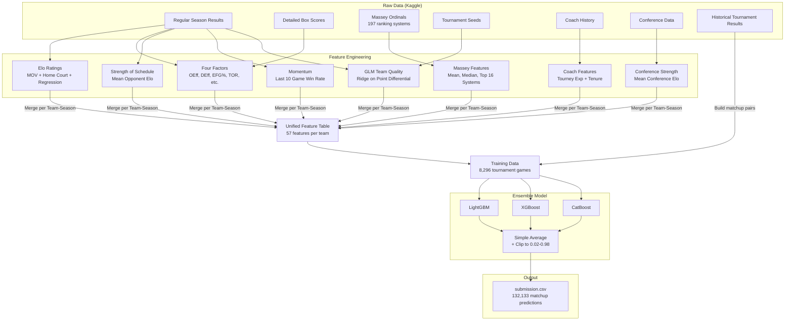
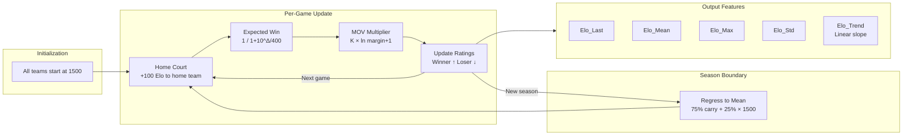
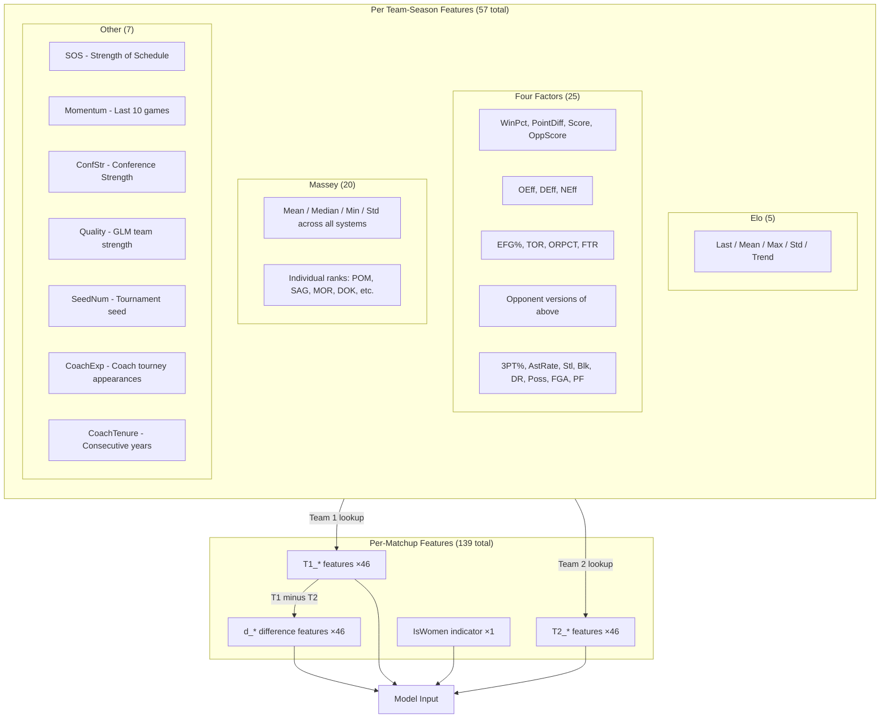
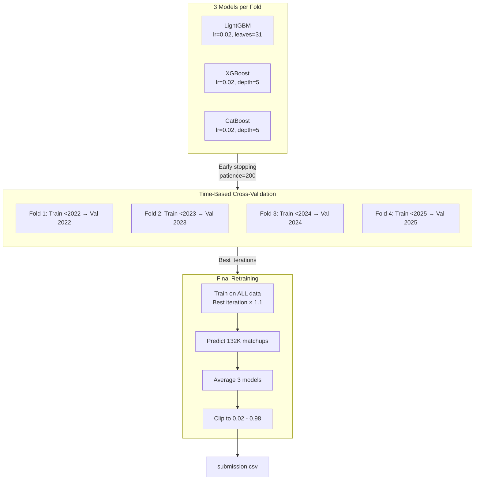
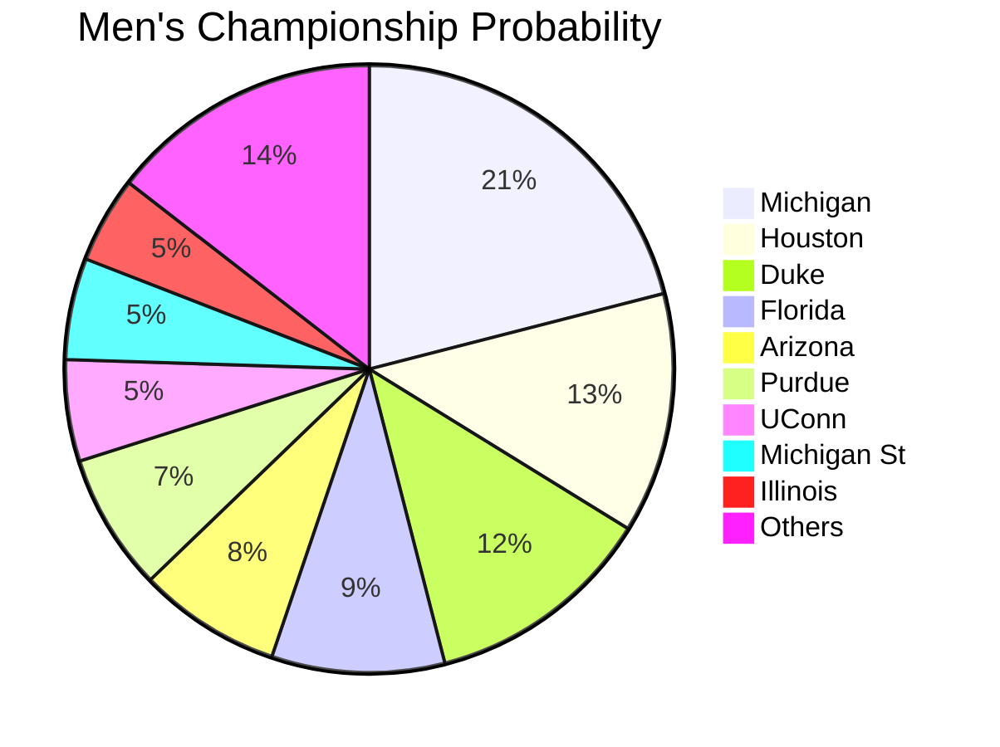
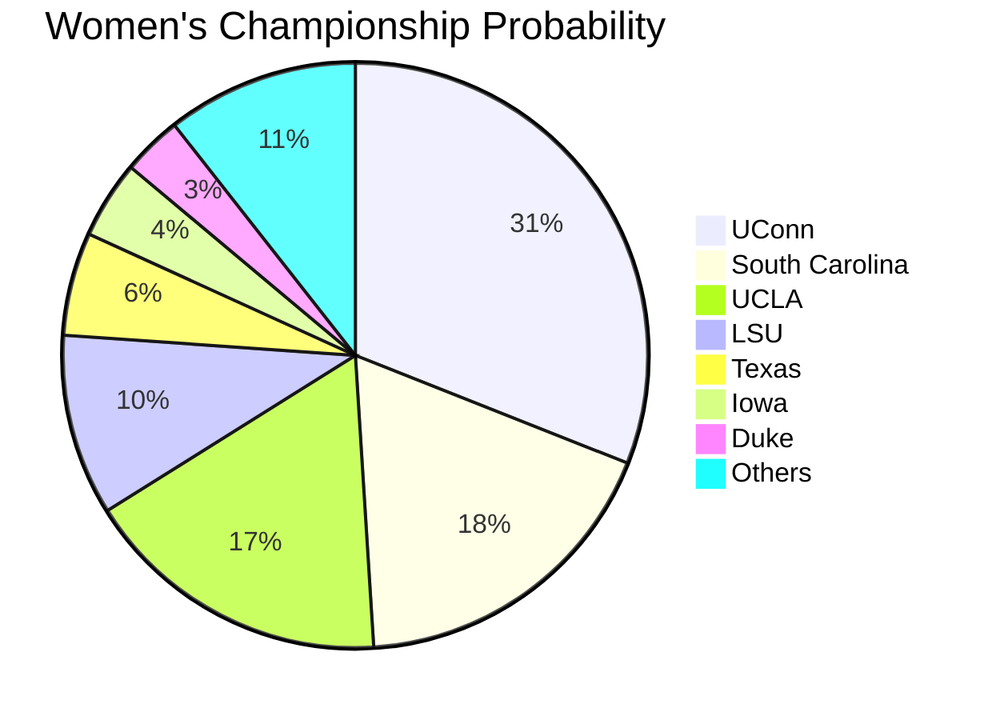
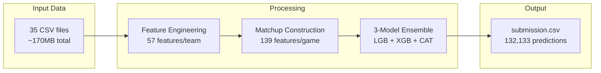

# March Machine Learning Mania 2026

Kaggle competition to predict the 2026 NCAA Men's and Women's basketball tournament outcomes.

**Competition:** [March Machine Learning Mania 2026](https://www.kaggle.com/competitions/march-machine-learning-mania-2026)
**Metric:** Brier Score (lower is better)
**OOF CV Score:** 0.1673

---

## Architecture Overview



---

## Elo Rating System



### Elo Parameters

| Parameter | Value | Why |
|-----------|-------|-----|
| K-factor base | 20 | Moderate update speed |
| Home advantage | +100 | ~65% home win rate in college hoops |
| Width | 400 | Standard Elo scale |
| Initial rating | 1500 | Neutral starting point |
| Season carry | 75% | Accounts for roster turnover |
| MOV scaling | ln(margin + 1) | Blowouts are more informative than 1-pt wins |

---

## Feature Engineering Pipeline



---

## Model Training Pipeline



### Cross-Validation Results

| Season | Brier Score | Games |
|--------|------------|-------|
| 2022 | 0.1889 | 536 |
| 2023 | 0.1935 | 536 |
| 2024 | 0.1607 | 536 |
| 2025 | 0.1262 | 536 |
| **Overall** | **0.1673** | **2144** |

### Model Hyperparameters

| Parameter | LightGBM | XGBoost | CatBoost |
|-----------|----------|---------|----------|
| Learning rate | 0.02 | 0.02 | 0.02 |
| Max depth/leaves | 31 leaves | depth 5 | depth 5 |
| Subsample | 0.8 | 0.8 | 0.8 |
| Col sample | 0.8 | 0.8 | - |
| Min samples | 15 | 15 | 15 |
| L1 reg | 0.1 | 0.1 | - |
| L2 reg | 1.0 | 1.0 | 3.0 |
| Max rounds | 2000 | 2000 | 2000 |
| Early stopping | 200 | 200 | 200 |

---

## Top Features (by LightGBM Gain)

| Rank | Feature | Description |
|------|---------|-------------|
| 1 | d_Elo_Max | Difference in peak Elo rating |
| 2 | d_Elo_Mean | Difference in average Elo |
| 3 | d_Elo_Last | Difference in final Elo |
| 4 | d_SOS | Difference in strength of schedule |
| 5 | d_ConfStr | Difference in conference strength |
| 6 | d_SeedNum | Difference in tournament seed |
| 7 | d_FTR | Difference in free throw rate |
| 8 | d_OEff | Difference in offensive efficiency |
| 9 | d_OppFG3Pct | Difference in opponent 3PT% allowed |
| 10 | d_PointDiff | Difference in avg point differential |

---

## 2026 Predictions

### Men's Championship Odds



| # | Team | Elo | Championship | Finals |
|---|------|-----|-------------|--------|
| 1 | Michigan | 2069 | 21.0% | 25.9% |
| 2 | Houston | 1967 | 12.8% | 17.2% |
| 3 | Duke | 2078 | 12.2% | 17.3% |
| 4 | Florida | 2035 | 9.2% | 11.9% |
| 5 | Arizona | 2032 | 7.6% | 10.0% |
| 6 | Purdue | 1884 | 7.3% | 23.7% |
| 7 | UConn | 1971 | 5.4% | 9.1% |
| 8 | Michigan St | 1935 | 5.4% | 19.9% |

### Women's Championship Odds



| # | Team | Elo | Championship | Finals |
|---|------|-----|-------------|--------|
| 1 | UConn | 2259 | 31.0% | 35.1% |
| 2 | South Carolina | 2200 | 18.0% | 20.0% |
| 3 | UCLA | 2212 | 17.1% | 18.8% |
| 4 | LSU | 2074 | 10.0% | 12.8% |
| 5 | Texas | 2131 | 5.7% | 6.8% |
| 6 | Iowa | 2015 | 4.3% | 25.1% |
| 7 | Duke | 2000 | 3.3% | 20.5% |

---

## Data Flow Summary



---

## Repository Structure

```
MarchMadness/
├── README.md                    # This file
├── submission_notebook.ipynb    # Main notebook (submit to Kaggle)
├── submission.csv               # Generated predictions
├── context.txt                  # Competition notes & reference links
├── kaggle.json                  # Kaggle API credentials (gitignored)
├── march-machine-learning-mania-2026/  # Competition data (gitignored)
│   ├── MRegularSeasonCompactResults.csv
│   ├── MRegularSeasonDetailedResults.csv
│   ├── MMasseyOrdinals.csv (128MB)
│   ├── MNCAATourneyCompactResults.csv
│   ├── MNCAATourneySeeds.csv
│   ├── SampleSubmissionStage2.csv
│   └── ... (35 files total)
└── notebooks/                   # Reference notebooks (gitignored)
    ├── goto-conversion-winning-solution.ipynb
    ├── ncaa-2026-stage2-lightgbm.ipynb
    ├── ncaa-2026-eda-elo-ratings-and-gradient-esemble.ipynb
    ├── ncaa2026-public-baseline-v1.ipynb
    ├── calculate-elo-ratings.ipynb
    └── ...
```

---

## Key Design Decisions

| Decision | Choice | Reasoning |
|----------|--------|-----------|
| Elo vs raw stats | Both | Elo captures team strength trajectory; stats capture play style |
| MOV in Elo | log(margin+1) | Blowouts informative but diminishing returns |
| Massey approach | Average + top 16 individual | Robust aggregate + specific signal from best systems |
| GLM Quality | Ridge regression | More stable than OLS for team fixed-effects model |
| Ensemble method | Simple average | Robust; weighted averaging rarely helps in practice |
| Prediction clipping | [0.02, 0.98] | Avoid catastrophic Brier penalty from extreme predictions |
| CV strategy | Time-based expanding | Respects temporal nature; no future data leakage |
| Training data | Tournament games only | Tournament dynamics differ from regular season |
| Missing 2026 seeds | Use other features | Seeds unavailable pre-Selection Sunday; model still works |
| Men + Women combined | Single model + IsWomen flag | More training data; model learns gender-specific patterns |

---

## Reference Notebooks Analyzed

| Notebook | Approach | Key Technique |
|----------|----------|---------------|
| goto-conversion | Betting odds conversion | Favourite-longshot bias correction |
| ncaa-2026-stage2-lightgbm | LightGBM classifier | Symmetric data augmentation |
| ncaa-2026-elo-gradient-ensemble | LGB+XGB+CAT ensemble | Four Factors + Elo + 30 features |
| ncaa2026-public-baseline-v1 | XGBoost regression | GLM quality + spline calibration |
| calculate-elo-ratings | Pure Elo | Rich Elo summary stats (trend, std) |
| march-mania-2026-starter | Logistic regression | Google ADK agent demo |
| lb-0-0-time-and-chance | Historical lookup | Stage 1 leaderboard exploit (not useful for Stage 2) |
