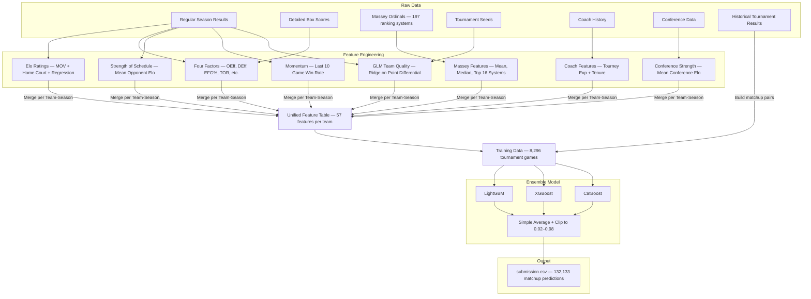
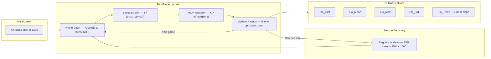
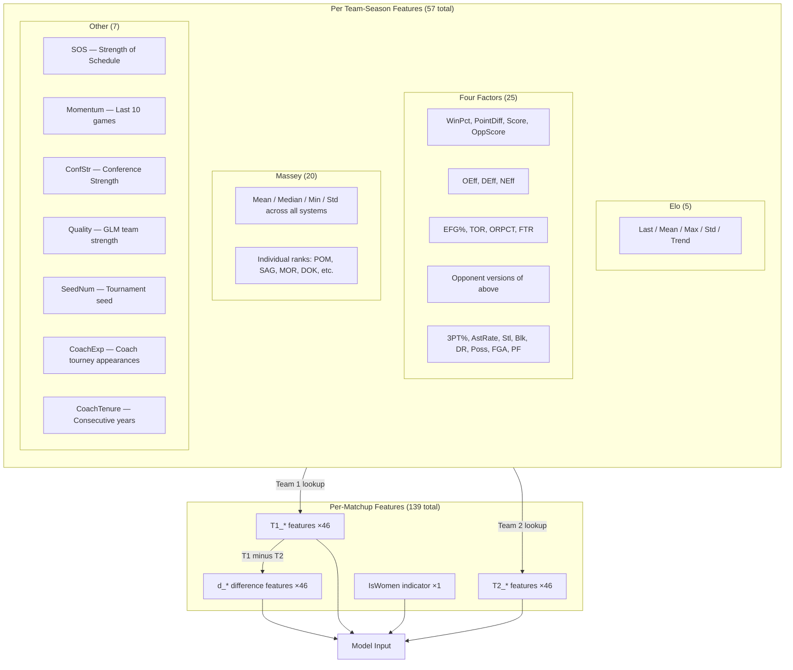
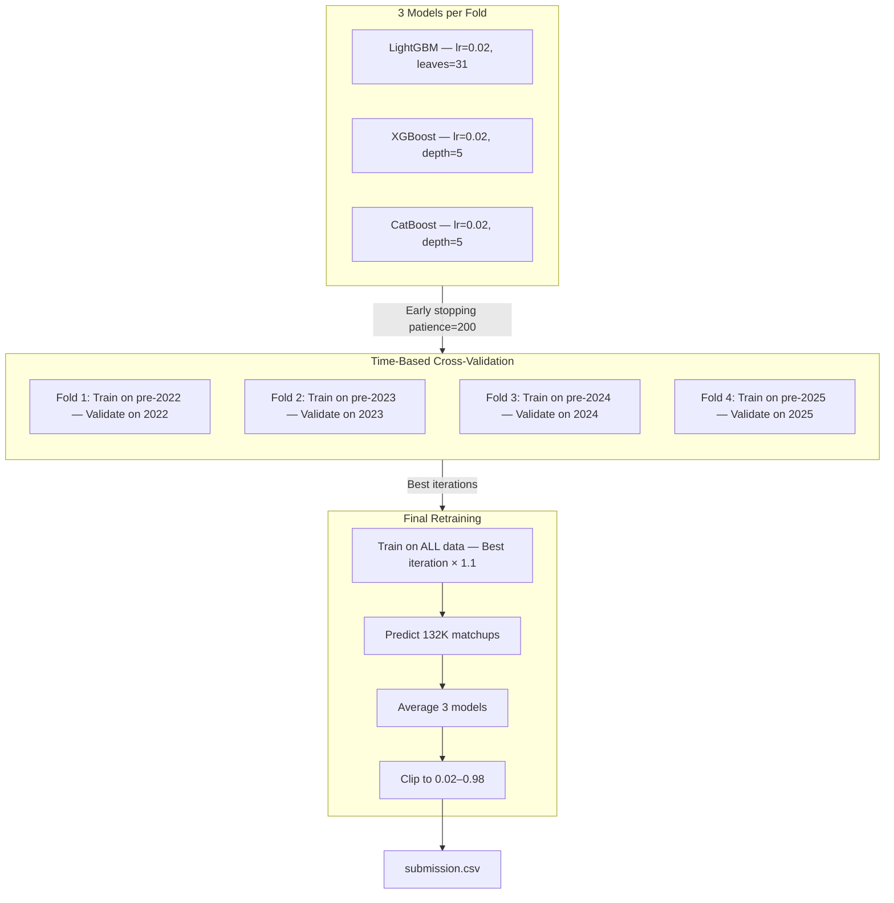

# Technical Documentation

Detailed architecture, feature engineering, model configuration, and design decisions.

---

## Architecture Overview



---

## Elo Rating System



### Elo Parameters

| Parameter | Value | Why |
|-----------|-------|-----|
| K-factor base | 20 | Moderate update speed |
| Home advantage | +100 | ~65% home win rate in college hoops |
| Width | 400 | Standard Elo scale |
| Initial rating | 1500 | Neutral starting point |
| Season carry | 75% | Accounts for roster turnover |
| MOV scaling | ln(margin + 1) | Blowouts are more informative than 1-pt wins |

---

## Feature Engineering Pipeline



---

## Model Training Pipeline



### Cross-Validation Results

| Season | Brier Score | Games |
|--------|:----------:|:-----:|
| 2022 | 0.1889 | 536 |
| 2023 | 0.1935 | 536 |
| 2024 | 0.1607 | 536 |
| 2025 | 0.1262 | 536 |
| **Overall** | **0.1673** | **2144** |

### Model Hyperparameters

| Parameter | LightGBM | XGBoost | CatBoost |
|-----------|:--------:|:-------:|:--------:|
| Learning rate | 0.02 | 0.02 | 0.02 |
| Max depth/leaves | 31 leaves | depth 5 | depth 5 |
| Subsample | 0.8 | 0.8 | 0.8 |
| Col sample | 0.8 | 0.8 | — |
| Min samples | 15 | 15 | 15 |
| L1 reg | 0.1 | 0.1 | — |
| L2 reg | 1.0 | 1.0 | 3.0 |
| Max rounds | 2000 | 2000 | 2000 |
| Early stopping | 200 | 200 | 200 |

---

## Top Features (by LightGBM Gain)

| Rank | Feature | Description |
|:----:|---------|-------------|
| 1 | d_Elo_Max | Difference in peak Elo rating |
| 2 | d_Elo_Mean | Difference in average Elo |
| 3 | d_Elo_Last | Difference in final Elo |
| 4 | d_SOS | Difference in strength of schedule |
| 5 | d_ConfStr | Difference in conference strength |
| 6 | d_SeedNum | Difference in tournament seed |
| 7 | d_FTR | Difference in free throw rate |
| 8 | d_OEff | Difference in offensive efficiency |
| 9 | d_OppFG3Pct | Difference in opponent 3PT% allowed |
| 10 | d_PointDiff | Difference in avg point differential |

---

## Key Design Decisions

| Decision | Choice | Reasoning |
|----------|--------|-----------|
| Elo vs raw stats | Both | Elo captures team strength trajectory; stats capture play style |
| MOV in Elo | log(margin+1) | Blowouts informative but diminishing returns |
| Massey approach | Average + top 16 individual | Robust aggregate + specific signal from best systems |
| GLM Quality | Ridge regression | More stable than OLS for team fixed-effects model |
| Ensemble method | Simple average | Robust; weighted averaging rarely helps in practice |
| Prediction clipping | [0.02, 0.98] | Avoid catastrophic penalty from extreme predictions |
| CV strategy | Time-based expanding | Respects temporal nature; no future data leakage |
| Training data | Tournament games only | Tournament dynamics differ from regular season |
| Missing 2026 seeds | Use other features | Seeds unavailable pre-Selection Sunday; model still works |
| Men + Women combined | Single model + IsWomen flag | More training data; model learns gender-specific patterns |

---

## Repository Structure

```
MarchMadness/
├── README.md                  # Project overview & predictions
├── TECHNICAL.md               # This file — full technical details
├── submission_notebook.ipynb   # Complete pipeline (runs on Kaggle)
└── .gitignore
```
